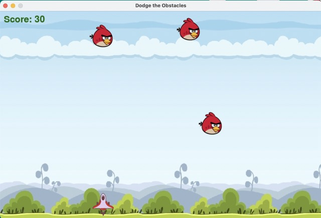

# Dodge the Obstacles



## Overview
"Dodge the Obstacles" is a simple 2D arcade-style game where the player controls a character to avoid falling obstacles and score points by shooting them. The game is built using the Pygame library in Python.

## Installation
1. Ensure you have Python installed on your system (preferably version 3.6 or higher).
2. Install Pygame using pip if you haven't already:
    ```sh
    pip install pygame
    ```
3. Download or clone the game repository to your local machine.

## Setup
1. Ensure the following files are located in a `data` directory within the game's root folder:
   - `background.jpg`: Background image for the game.
   - `background_music.ogg`: Background music file.
   - `player.png`: Image representing the player character.
   - `weapon.png`: Image representing the weapon.
   - `obstacle.png`: Image representing the obstacles.
   - `collision_sound.wav`: Sound effect for collisions.
   - `shoot_sound.wav`: Sound effect for shooting.

2. Run the game by executing the script:
    ```sh
    python game.py
    ```

## How to Play
- Use the left and right arrow keys to move the player character horizontally across the screen.
- Press the spacebar to shoot weapons upwards to destroy obstacles.
- Avoid collision with falling obstacles to keep playing.
- Score points by shooting and destroying obstacles.
- The game ends when the player character collides with an obstacle.

## Controls
- **Left Arrow Key**: Move left
- **Right Arrow Key**: Move right
- **Spacebar**: Shoot weapon
- **A Key**: Play again after game over

## Game Elements
- **Player**: The character controlled by the player. Image file: `player.png`.
- **Obstacles**: Falling objects to avoid. Image file: `obstacle.png`.
- **Weapons**: Objects shot by the player to destroy obstacles. Image file: `weapon.png`.
- **Background Music**: Loops throughout the game. Audio file: `background_music.ogg`.
- **Collision Sound**: Plays when the player hits an obstacle. Audio file: `collision_sound.wav`.
- **Shoot Sound**: Plays when a weapon is fired. Audio file: `shoot_sound.wav`.

## Code Structure
- **Initialization**: Sets up the Pygame environment, loads assets, and initializes game variables.
- **Main Game Loop**: Runs the core game logic, including event handling, player movement, obstacle generation, collision detection, and rendering.
- **Game Over**: Displays the game over screen and waits for the player to choose to play again or quit.
- **Helper Functions**:
  - `display_score(x, y)`: Displays the current score at the given coordinates.
  - `game_over()`: Displays the game over screen with the final score.
